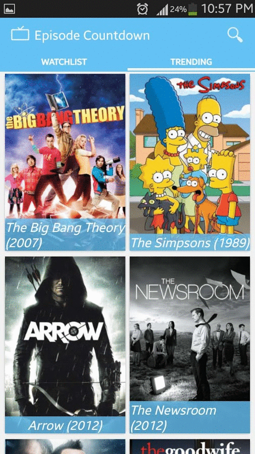
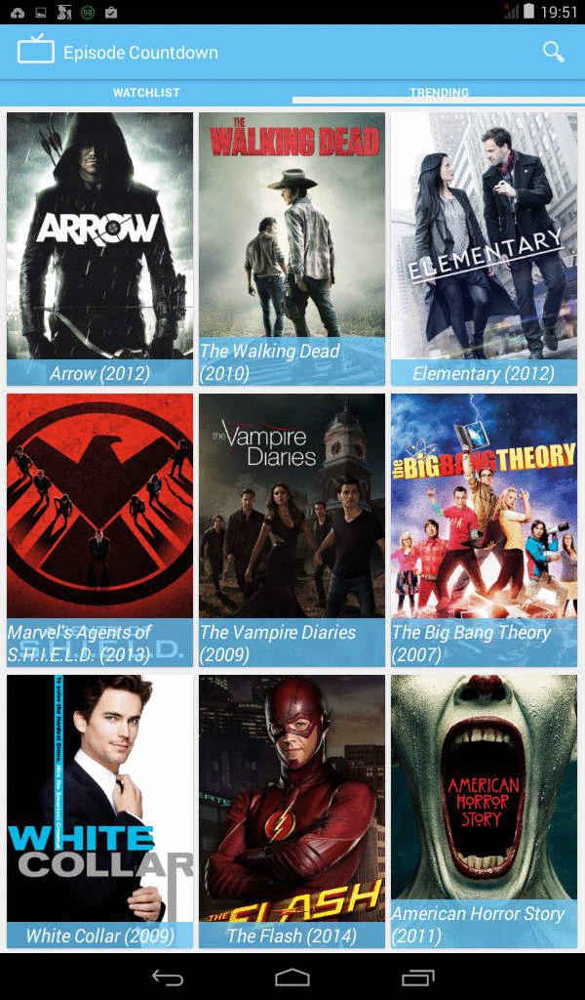

# EpisodeCountdown
Wondering when your favorite TV show will air next? Episode Countdown lets you view the time remaining to your favorite TV show's next episode.

Screenshots for phone

Screenshots for 7" tab

Features:
- Manage Your Watchlist: Add your favorite TV shows to watchlist for easy tracking. 
- View Trending Shows: See a list of shows that have been trending recently.
- View Show Details: View details for a TV show including its overview, airtime and trakt rating. 
- Works Offline: A TV Show Once added to your watchlist can be viewed offline. 
- No sign-in: Just download and start using it. No sign in required.
- No special Permissions Required: Only internet and data storage permissions required.

------
# Note: Not maintained
Episode Countdown was made in 2014 as a part of learning android application development and was available on PlayStore. 
However, since then Trakt.com has changed its API and TvRage.com has shut down so it no longer works.
This code is for reference only.